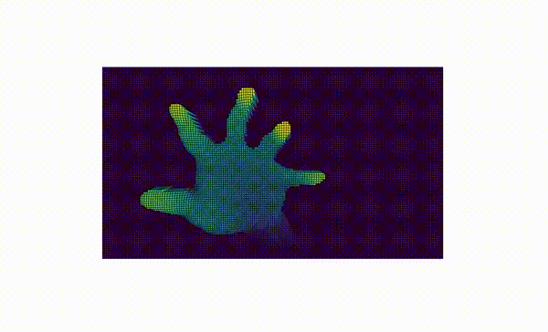

# Kinect-OCV

Scripts to read the kinect sensor depth map and to generate 3d meshes.

`blog_pi.py` - This script is to run the kinect sensor using Open CV in python, the installation and setup for using a Raspberry Pi is described here. However it should run on any device with Open CV, libfreenect2 and pylibfreenetc2 installed. In other we can scan and produce an image like the one below.

The notebook `3DRENDERS.ipynb` contains a small set of interactve cv2 filters to remove some edges and to generate a 3d mesh of the image loaded, using Pyvista. In other words we take the image produced with the sensor and produce a mesh like the one below.

A full tutorial on the hardware setup and about using `blog_pi.py` can be found [here](https://www.hackster.io/kupkasmale/super-cheap-3d-scanner-camera-controller-b1ff81)

For the mesh rendering, a tutorial alongside a brief set of real time interactive rendering views, can be found [here](https://calugo.github.io/posts/3d-fun-with-kinect-and-pyvista/)

